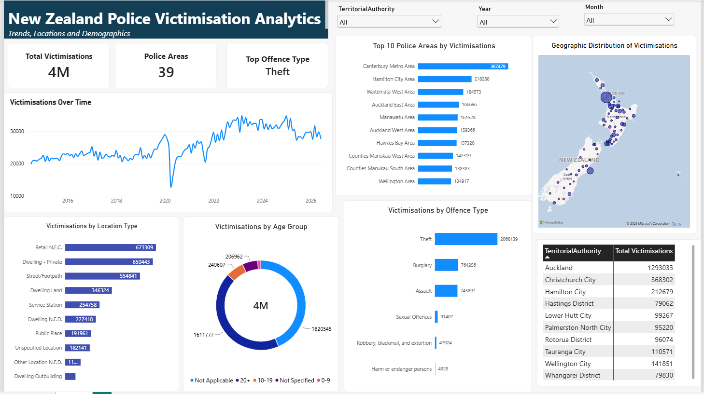

# New Zealand Police Victimisation Analytics

An end-to-end data analytics project using **Databricks, PySpark, Delta Lake, and Power BI** to analyse New Zealand Police recorded crime victimisation data.

The project demonstrates the complete analytics workflow from raw data ingestion and transformation through to an interactive Power BI dashboard.

## Project Overview

The objective of this project was to analyse New Zealand Police victimisation data and identify patterns across time, geographic areas, offence types, location types, and demographic groups.

The source dataset contained more than **1.5 million records**. Databricks and PySpark were used to clean, transform, and aggregate the data before loading the analytical dataset into Power BI.

The final dashboard allows users to explore recorded victimisations using interactive filters for year, month, and territorial authority.

## Data Pipeline

The project follows a Silver/Gold data preparation approach:

Raw NZ Police Data  
| 
Databricks  
|  
PySpark Data Cleaning & Transformation  
|  
Silver Delta Table  
|  
Data Aggregation  
|  
Gold Delta Table  
|  
Power BI  
|  
Interactive Dashboard

## Technologies Used

- Databricks
- PySpark
- Apache Spark
- Delta Lake
- Power BI
- DAX
- Python

## Data Preparation

The raw dataset was processed in Databricks using PySpark.

Key transformation steps included:

- Loading and inspecting more than 1.5 million records
- Converting the source month field into a valid date
- Standardising column names
- Cleaning Territorial Authority values
- Creating Year and Month attributes
- Creating a cleaned Silver Delta table
- Aggregating victimisation counts across analytical dimensions
- Creating a Gold Delta table optimised for Power BI reporting

The Gold dataset contains dimensions including:

- Date
- Year
- Month
- Territorial Authority
- Police Area
- Offence Type
- Location Type
- Age Group
- ROV Division
- Person/Organisation

## Power BI Dashboard

The Gold Delta table was connected from Databricks to Power BI and used to build an interactive analytical dashboard.

The dashboard includes:

- Total recorded victimisations
- Number of Police Areas
- Top offence type
- Victimisation trends over time
- Top Police Areas by victimisations
- Victimisations by offence type
- Victimisations by location type
- Victimisations by age group
- Territorial Authority analysis
- Geographic distribution of victimisations
- Interactive Year, Month, and Territorial Authority filters

## Dashboard Preview



## Key DAX Measures

### Total Victimisations

```DAX
Total Victimisations =
SUM(police_victimisations_gold[TotalVictimisations])


Police Areas =
DISTINCTCOUNT(police_victimisations_gold[PoliceArea])

Top Offence Type =
VAR TopOffence =
    TOPN(
        1,
        VALUES(police_victimisations_gold[AnzsocDivision]),
        [Total Victimisations],
        DESC
    )
RETURN
    CONCATENATEX(
        TopOffence,
        police_victimisations_gold[AnzsocDivision],
        ""
    )
```
