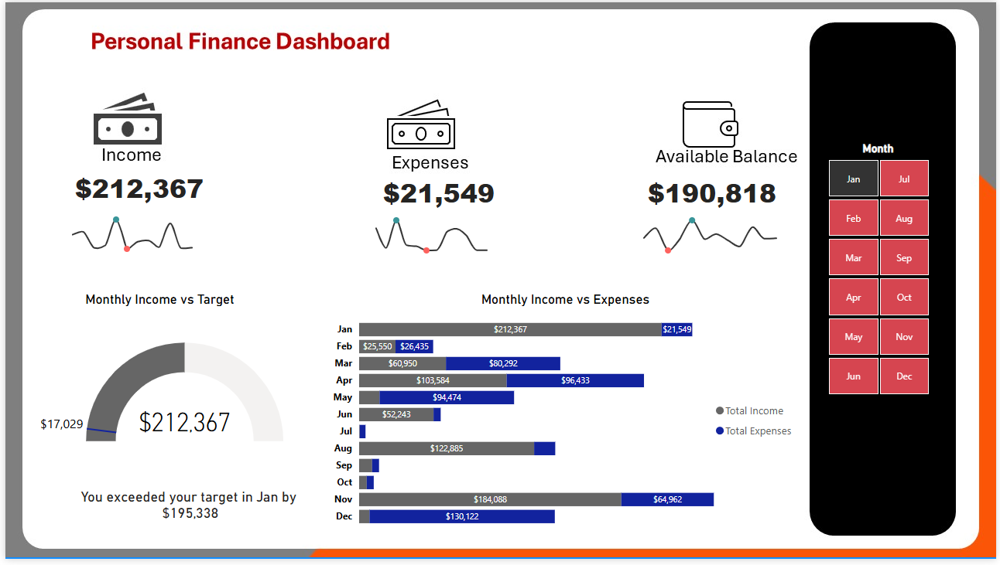

# Personal Finance Dashboard

## Project Overview

This Power BI project provides an interactive dashboard for analysing monthly financial performance. The dashboard enables users to monitor income, expenses, available balance, and actual income against monthly income targets.

The report includes interactive month filtering, KPI cards, income target comparison, and monthly income and expense analysis.

## Business Objective

The objective of this dashboard is to provide a clear view of financial performance and answer key questions such as:

- How much income was generated each month?
- How much was spent each month?
- What is the available balance after expenses?
- Is actual income meeting the monthly income target?
- How do income and expenses change throughout the year?

## Tools & Technologies

- Power BI
- Power Query
- DAX
- Data Modelling
- Data Visualisation

## Dashboard

